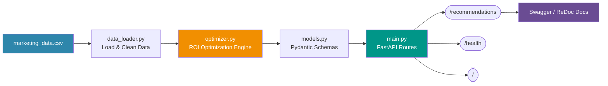
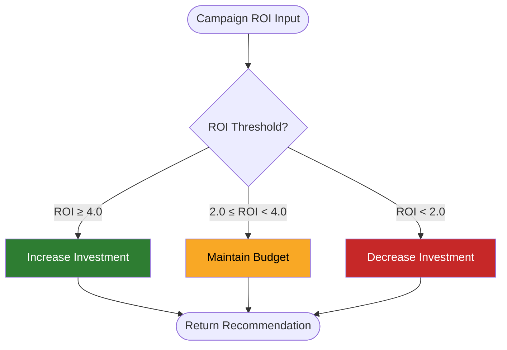
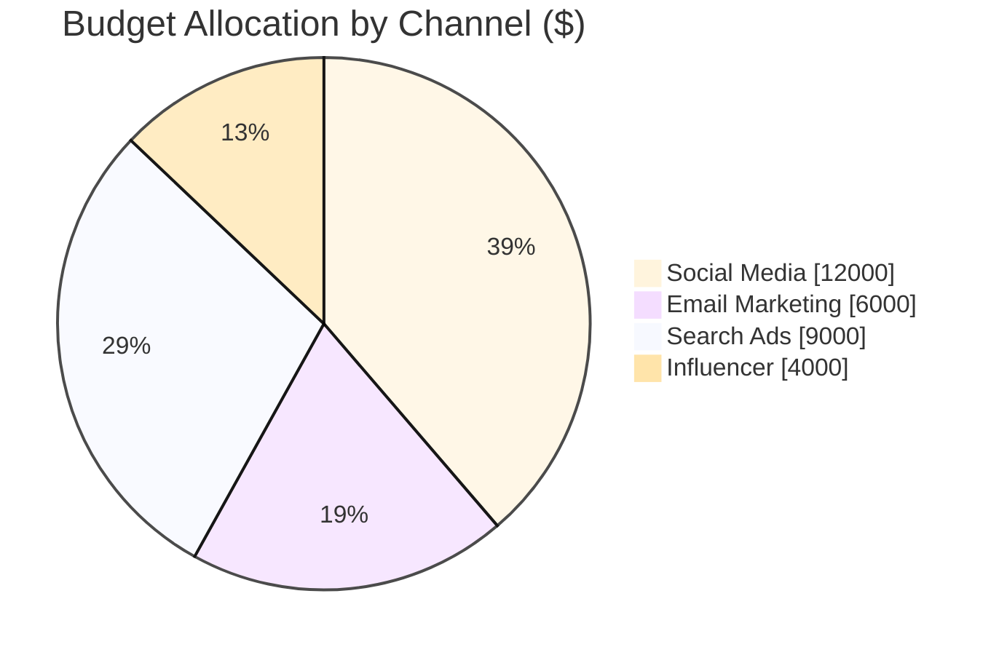

<div align="center">

#  CPG Daily Marketing Optimizer

### Rule-based, ROI-driven daily budget optimization for Consumer Packaged Goods brands

[](https://www.python.org/)
[](https://fastapi.tiangolo.com/)
[](https://www.docker.com/)
[](https://github.com/features/actions)
[](#-license)

[](https://github.com/Vaishnavi1607678/cpg-marketing-optimizer/stargazers)
[](https://github.com/Vaishnavi1607678/cpg-marketing-optimizer/network/members)
[](https://github.com/Vaishnavi1607678/cpg-marketing-optimizer/commits/main)
[](https://github.com/Vaishnavi1607678/cpg-marketing-optimizer/issues)

<br/>

**A FastAPI backend that turns raw campaign data into daily, ROI-driven marketing budget recommendations — fully containerized, tested, and shipped with CI/CD.**

[Overview](#-project-overview) •
[Features](#-features) •
[Architecture](#-architecture) •
[Quickstart](#%EF%B8%8F-installation) •
[API](#-api-endpoints) •
[Docker](#-docker) •
[Roadmap](#-future-enhancements)

</div>

---

##  Project Overview

Marketing teams invest across multiple channels every single day — social, search, email, display, influencer — and budgets are usually rebalanced on gut feel. **CPG Daily Marketing Optimizer** replaces the guesswork with a lightweight API that ingests campaign performance data and recommends where to shift budget for maximum **Return on Investment (ROI)**.

> Built as a portfolio-grade demonstration of production backend practices: clean API design, automated testing, containerization, and CI/CD — not just a script that "works on my machine."

---

##  Features

| | |
|---|---|
|  **ROI-Based Optimization** | Recommends increase / maintain / decrease per channel based on performance |
|  **FastAPI REST API** | Async-ready, auto-documented, type-validated with Pydantic |
|  **CSV Dataset Integration** | Plug in your own campaign data with zero code changes |
|  **Intelligent Optimization Logic** | Rule-based engine, designed to be swapped for an ML model later |
|  **Automated Testing** | Pytest suite covering core API behavior |
|  **Docker Containerization** | One command to build, one command to run — anywhere |
|  **GitHub Actions CI/CD** | Tests + Docker build run automatically on every push/PR |
|  **Interactive Docs** | Swagger UI and ReDoc generated for free |

---

##  Architecture



### Recommendation Logic Flow



---

##  Tech Stack

| Category | Technology |
|----------|------------|
| Language | Python 3.12 |
| API Framework | FastAPI |
| Testing | Pytest |
| Data Processing | Pandas |
| ASGI Server | Uvicorn |
| Containerization | Docker |
| CI/CD | GitHub Actions |
| Version Control | Git & GitHub |

---

##  Project Structure

```text
cpg-marketing-optimizer/
│
├── app/
│   ├── __init__.py
│   ├── main.py
│   ├── optimizer.py
│   ├── models.py
│   └── data_loader.py
│
├── data/
│   └── marketing_data.csv
│
├── tests/
│   └── test_api.py
│
├── .github/
│   └── workflows/
│       └── ci-cd.yml
│
├── Dockerfile
├── requirements.txt
├── README.md
└── LICENSE
```

---

##  Installation

**1. Clone the repository**
```bash
git clone https://github.com/Vaishnavi1607678/cpg-marketing-optimizer.git
```

**2. Navigate to the project**
```bash
cd cpg-marketing-optimizer
```

**3. Create a virtual environment**
```bash
python -m venv .venv
```

**4. Activate it**

Windows
```bash
.venv\Scripts\activate
```

Linux / macOS
```bash
source .venv/bin/activate
```

**5. Install dependencies**
```bash
pip install -r requirements.txt
```

---

## ▶️ Run the Application

```bash
uvicorn app.main:app --reload
```

The application will be available at:
```
http://127.0.0.1:8000
```

---

##  API Documentation

| Docs | URL |
|---|---|
| Swagger UI | `http://127.0.0.1:8000/docs` |
| ReDoc | `http://127.0.0.1:8000/redoc` |

---

##  API Endpoints

| Method | Endpoint | Description |
|---------|----------|-------------|
| `GET` | `/` | Welcome endpoint |
| `GET` | `/health` | Health check |
| `GET` | `/recommendations` | Returns optimized marketing recommendations |

---

##  Running Tests

```bash
pytest
```

---

##  Docker

**Build the image**
```bash
docker build -t cpg-marketing-optimizer .
```

**Run the container**
```bash
docker run -p 8000:8000 cpg-marketing-optimizer
```

---

##  CI/CD Pipeline


This project uses **GitHub Actions** for Continuous Integration, automatically running on every push and pull request to the `main` branch.

---


##  Sample Response

```json
[
  {
    "channel": "Social Media",
    "budget": 12000,
    "roi": 4.2,
    "recommendation": "Increase investment"
  },
  {
    "channel": "Email Marketing",
    "budget": 6000,
    "roi": 3.5,
    "recommendation": "Maintain budget"
  }
]
```

### Sample Channel ROI Snapshot



---

##  Future Enhancements

- [ ] AWS deployment (ECS/EKS)
- [ ] Kubernetes support
- [ ] Terraform infrastructure
- [ ] ML-powered budget prediction
- [ ] Prometheus & Grafana monitoring
- [ ] Database integration
- [ ] Authentication & authorization


### Made with using FastAPI, Docker, and GitHub Actions

</div>
